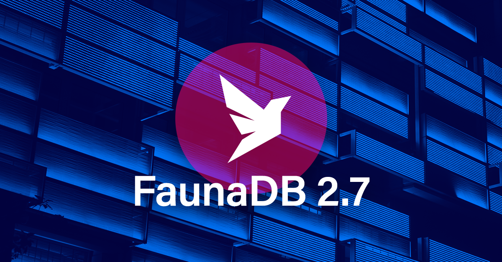
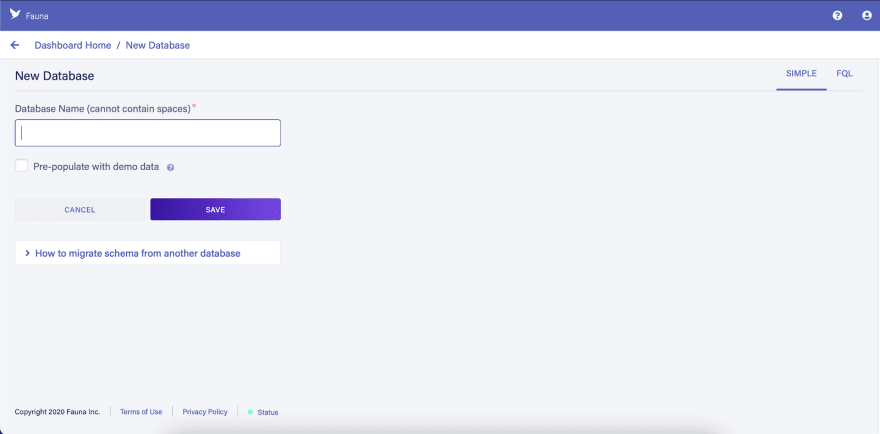
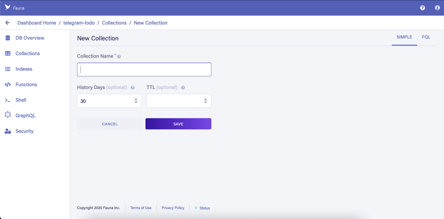

# TellTodo🤖 🦜

  

## Meet TellTodo👋

TellTodo is a Python and a FaunaDB powered telegram bot which helps you to manage your daily task with the help of Todo-List, you can ask TellTodo to perform the following operations:

- [x] Add/Create your daily task in the todo list
- [x] Check your status of the task weither it is completed or not
- [x] Update your todo list task status to completed.
- [x] List your Todo List
- [x] Delete your Todo list/Task

## How TellTodo is Built?

TellTodo uses Python 3.8 Programing Language and one of the Latest and a Serverless Database which is FaunaDB.

### FaunaDB

  

Fauna is a ***Serverless Database***, a serverless database is one where all maintenance and operational responsibility is outside of a developer or application’s concern, and all traffic/CRUD is accommodated with on-demand scaling. This reduces the load and effort put into managing the database resources, especially when the application begins to scale to support a large number of users.

There are a lot of advantages of picking a serverless database for your application aside from reducing work in managing database resources. They include:

* Database operational cost reduction
* Real-time database access
* Increase in productivity (since the burden of database management is removed)
* Infinite scalability
* Improved database security

we now know Fauna is a serverless database, but **how does it store and handle data?** At its core, Fauna is a **document database** that offers two interfaces, ***GraphQL*** and the ***Fauna Query Language (FQL)***. Databases can store collections, indexes, and even other databases (yay multi-tenancy!). Within collections are documents, which by default, don’t have strict schema requirements. Fauna is capable of handling a variety of data types (e.g. temporal) but is particularly impressive for having first-class support for relational data. We’ll be exploring most of this together momentarily, but if you’re eager to learn even more, check out the [Fauna documentation](https://docs.fauna.com/fauna/current/index.html)!

### Getting Started with TellTodo Local Setup

**Setup FaunaDB:**

1. Create the account on [FaunaDB](https://dashboard.fauna.com/accounts/register)

2. Click on `New Database`

  

3. After creating a Database, Click on `Collections` then `New Collection`

  

Give the name to the collection as `users` as users name is default with our bot.

4. Similarly, create another new collection named as `todo` as todo is default with our bot.

5. Now, move to `Index` and create a `New Index` and make sure that the ***Source Collection*** is `users` and ***Terms*** is `data.id` with a ***Name*** `users`.

6. Similarly create `New Index` ***Source Collection*** is `todo` and ***Terms*** is `data.user_id` with a ***Name*** `todo`

After a sucessfull setup your Index and collection will look like:

  

  

  

